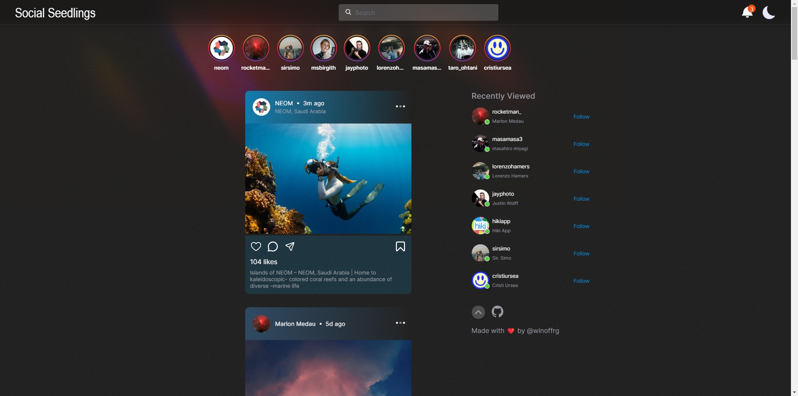

# Social Seedlings
A web app having functionality similar to Instagram's News Feed and Profile
Section using Unsplash OpenApi. 💫

## Features
1. Server & Client Side Caching
2. Server Side Rendered Pages with proper Hydration
3. Infinite Scrolling on Home and User Profile Page
4. Recently Viewed Users w/ LRU Cache
5. Dark Mode, Responsive Design, Intitutive UI
6. Persist Like, Follow, Cache states on page refresh
7. Page Progress, Go to Top, Scroll Restoration
8. Progressive Image Loading w/ Blur Hash and Lazy Loading
9. Conditional image fetching based on client viewport 
10. Meta Tags for SEO, Lowest Bundle Size, 100 Lighthouse Score

## Development
1. Custom Hooks with Internal State Management
2. Zustand global store for atomic state updates
3. Accessible Buttons, Image Components, and Titles
4. Support for Typescript, Prettier, Eslint
5. Clean Architecture, Separated Hooks, Components, Utils
6. Vercel Edge Caching for API Responses for SSR'ed pages